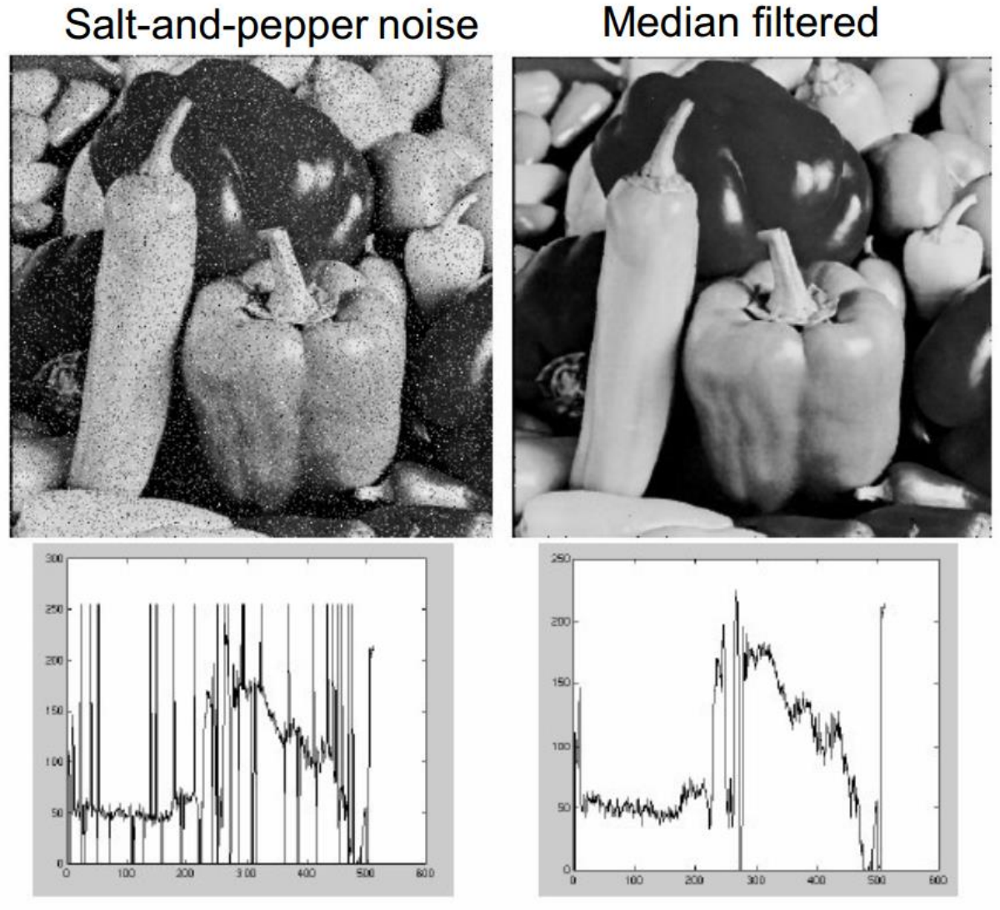

# 图像滤波器

## 图像卷积与互相关

利用信号处理中的卷积的定义，将图像卷积描述为
$$
g(x,\ y) = f * w =  \sum_{s = -a}^{a} \sum_{t = -b}^{b} f(x - s,\ y - t) w(s,\ t)
$$
为了保证像素值的合法性，通常需要对卷积核进行归一化操作
$$
g(x,\ y) = \left[ \sum_{s = -a}^{a} \sum_{t = -b}^{b} f(x - s,\ y - t) w(s,\ t) \right] \bigg/ \left[ \sum_{s = -a}^{a} \sum_{t = -b}^{b} w(s,\ t) \right]
$$
在图像处理中通常使用互相关操作，即不需要卷积中的反褶
$$
g(x,\ y) = f \odot w = \sum_{s = -a}^{a} \sum_{t = -b}^{b} f(x + s,\ y + t) w(s,\ t)
$$
图像卷积和互相关都具有（1）线性（2）平移不变性 的性质，一般地，在图像处理中，满足以上性质的算子都可以被描述为卷积或互相关的操作。同时图像卷积也拥有信号处理中的卷积的其他性质。

为了调整图像卷积输出的尺寸，可以对被卷积的图像进行填充操作。常见的填充策略有 full、same、valid 等

即输出尺寸为 $f$ 和 $w$ 尺寸之和、输出尺寸保持为 $f$ 的尺寸以及输出尺寸为 $f$ 和 $w$ 尺寸之差。

如果需要在图像外进行填充像素，填充方式有（1）补零（2）边界翻转（3）边界复制（4）边界镜像。

   

## 常见的卷积核

- 均值滤波核

均值滤波对局部的像素值直接进行平均操作
$$
\mathbf{K}(n) = \frac{1}{n} \begin{bmatrix}
    1 & 1 & \cdots & 1 \\[1mm]
    1 & 1 & \cdots & 1 \\[1mm]
    \vdots & \vdots & \ddots & \vdots \\[1mm]
    1 & 1 & \cdots & 1
\end{bmatrix}_{n \times n}
$$
但均值滤波核在频域为抽样函数，在高频部分具有周期振荡的性质，会导致图像中的高频分量（如图像边缘）产生波纹状的振铃，该效应被称为振铃效应。

- 高斯滤波核

高斯滤波核的数值符合高斯函数（取整前）
$$
G(\sigma) = \frac{1}{2 \pi \sigma^{2}} \exp \left( -\frac{x^{2} + y^{2}}{2\sigma^{2}} \right) = \frac{1}{\sqrt{2\pi}\sigma} \exp \left( -\frac{x^{2}}{2 \sigma^{2}} \right) \cdot \frac{1}{\sqrt{2 \pi }\sigma} \exp \left( -\frac{y^{2}}{2 \sigma^{2}} \right)
$$
高斯滤波核的尺寸一般设为 $3\sigma$，并且可以通过可拆分性降低计算复杂度。并且高斯滤波核在频域仍然为高斯函数，效果相当于一个低通滤波器，会滤除图像中的高频分量，起到平滑的效果。对于图片中的高斯噪声（频域上体现为高频分量）具有很好的降噪效果，但是会模糊图像中的边缘信息。

- 中值滤波核

中值滤波核使用周围像素值的中值代替锚点的像素值，对局部异常值（如椒盐噪声）有较好的鲁棒性，属于非线性的卷积核，但是为了寻找中值而进行的排序操作导致了较高的时间复杂度。

