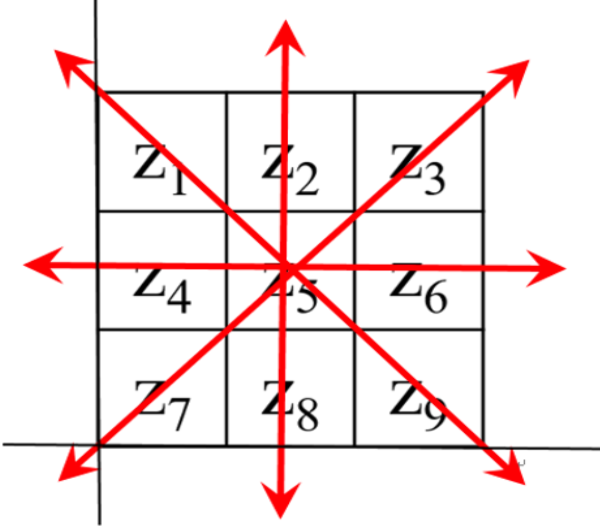
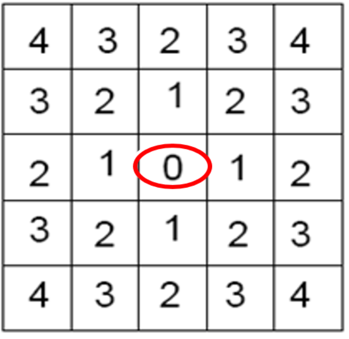
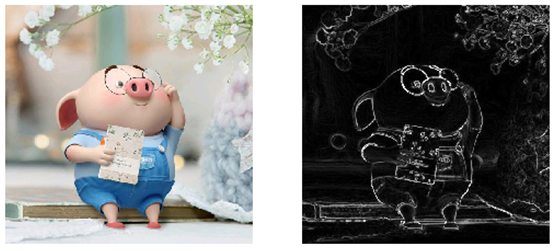
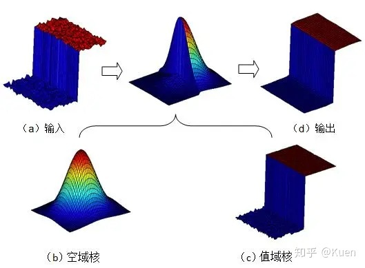
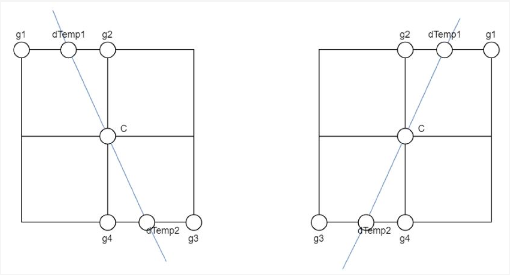
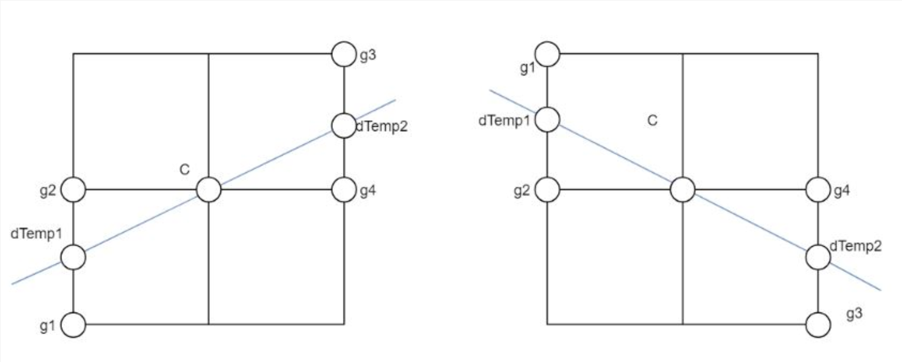

# 边缘检测

边缘的直观感受：图像中灰度变化较强的区域。

## 梯度检测算子

图像中的边缘带有较大的像素值的变化，可以利用图像梯度来检测边缘。
$$
\begin{gather*}
    \frac{\partial f(x,\ y)}{\partial x} \approx f(x + 1,\ y) - f(x,\ y) \\[5mm]
    \frac{\partial f(x,\ y)}{\partial y} \approx f(x,\ y + 1) - f(x,\ y) \\[5mm]
    \nabla f = \begin{bmatrix}
        \dfrac{\partial f(x,\ y)}{\partial x} & \dfrac{\partial f(x,\ y)}{\partial y}
    \end{bmatrix}
\end{gather*}
$$
可以分别采用以下卷积核简单地实现每个像素点处的图像偏导数的计算。
$$
\partial_{x} = \begin{pmatrix}
    \underline{\underline{-1}} & 1
\end{pmatrix} \quad
\partial_{y} = \begin{pmatrix}
    \underline{\underline{-1}} \\[3mm]
    1
\end{pmatrix}
$$
以上两个卷积核分别能够检测出纵向的边缘和横向的边缘，以下是其他的一些梯度算子：

- Roberts 算子：突出 45$\degree$ 以及 135$\degree$ 走向的边缘
$$
\mathcal{G}_{x} = \begin{pmatrix}
    -1 & 0 \\[3mm]
    0 & 1
\end{pmatrix} \qquad \mathcal{G}_{y} = \begin{pmatrix}
    0 & -1 \\[3mm]
    1 & 0
\end{pmatrix}
$$

- Prewitt 算子：结合检测所有方向的边缘。

$$
\mathcal{G}_{x} = \begin{pmatrix}
    -1 & 0 & 1 \\[3mm]
    -1 & 0 & 1 \\[3mm]
    -1 & 0 & 1
\end{pmatrix} \qquad \mathcal{G}_{y} = \begin{pmatrix}
    -1 & -1 & -1 \\[3mm]
    0 & 0 & 0 \\[3mm]
    1 & 1 & 1
\end{pmatrix}
$$

- Sobel 算子：在计算像素差分时考虑相邻像素的曼哈顿距离，对噪声具有更好的抗性。

 &emsp;&emsp;

$$
\mathcal{G}_{x} = \begin{pmatrix}
    -1 & 0 & 1 \\[3mm]
    -2 & 0 & 2 \\[3mm]
    -1 & 0 & 1
\end{pmatrix} \qquad \mathcal{G}_{y} = \begin{pmatrix}
    -1 & -2 & -1 \\[3mm]
    0 & 0 & 0 \\[3mm]
    1 & 2 & 1
\end{pmatrix}
$$

## Canny 检测算法

Canny 检测算法大致分为以下几步

- 图像去噪

对于图像中存在的噪声，需要首先进行平滑去噪，再进行梯度检测，否则会检测到大量由噪声产生的梯度。对于去噪方式，除了高斯滤波外，也可以选择双边滤波，可以更好地保留边缘信息。

双边滤波会降低与被卷积像素值差异较大的像素值的权重，也就是让平滑效果只作用在区域内部，可以使用值域卷积核来描述这种加权行为
$$
\mathcal{B}_{r}(i,\ j \mid k,\ l) = \exp \left( -\frac{ || f(i,\ j) - f(k,\ l) ||^{2}}{2 \sigma_{r}^{2}} \right)
$$
同时空域卷积核仍然采用高斯滤波核的形式
$$
\mathcal{B}_{s}(i,\ j \mid k,\ l) = \exp \left( -\frac{(i - k)^{2} + (j - l)^{2}}{2 \sigma_{s}^{2}} \right)
$$

经过值域卷积核加权后的双边滤波核
$$
\begin{align*}
    \mathcal{B}(i,\ j \mid k,\ l) &= \mathcal{B}_{r}(i,\ j \mid k,\ l) \cdot \mathcal{B}_{s}(i,\ j \mid k,\ l) \\[5mm]
    &= \exp \left( -\frac{|| f(i,\ j) - f(k,\ l) ||^{2}}{2 \sigma_{r}^{2}} - \frac{(i - k)^{2} + (j - l)^{2}}{2 \sigma_{s}^{2}}  \right)
\end{align*}
$$

不同的空域方差和值域方差产生的双边滤波效果如下，同时对比相同空域方差的高斯滤波的效果

- 计算图像梯度

采用 Sobel 算子分别计算出横向和纵向的偏导数，并得到最终的梯度大小和方向
$$
\begin{gather*}
    \partial_{x} f = \mathcal{G}_{x} \odot f \qquad \partial_{y} f = \mathcal{G}_{y} \odot f \\[5mm]
    || \nabla f || = \sqrt{\partial_{x} f^{2} + \partial_{y} f^{2}} \qquad \theta(f) = \arctan \left( \partial_{x} f \bigg/ \partial_{y} f \right)
\end{gather*}
$$

- 非极大值抑制（NMS）

针对原始边缘检测算子检测到的边缘较粗的问题，可以采用非极大值抑制的方式去除非梯度极大值的检测结果，具体来说，在每个像素点处，判断其梯度是否大于梯度方向上相邻的两个 “像素点” 处的梯度。

上一步计算出的梯度方向存在着四种可能的朝向，两个虚拟 “像素点” 的梯度可以通过邻近的真实像素点的梯度按照距离进行加权求和来近似估计。

对于非极大梯度值的像素点将其梯度置零，实现对原始算子检测出的边缘的细化效果。

 &emsp;

- 双阈值筛选

为了去除非边缘和部分弱边缘，可以设置两个阈值 max 和 min，对于梯度值大于 max 的像素点认为是强边缘被保留；对于梯度值小于 min 的像素点认为是非边缘被置零；对于梯度值介于二者之间的像素点认为是弱边缘，弱边缘需要通过与强边缘的连通性来判断是否保留，即判断周围相邻的 8 个像素是否为强边缘。

 &emsp;

