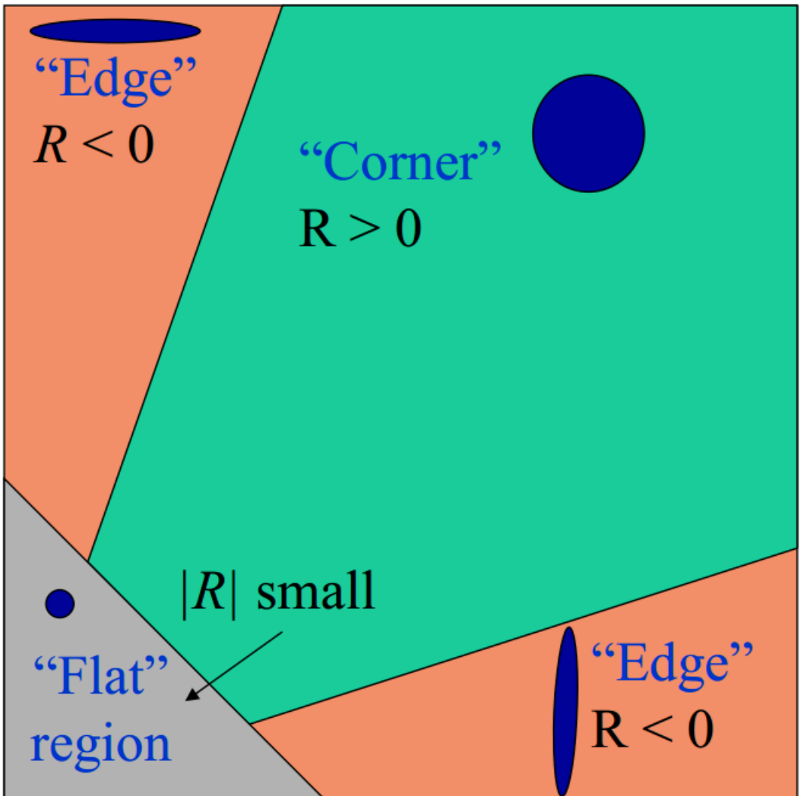

# 角点检测

角点的直观感受：图像中在多个方向上都具有较强的灰度变化的区域。

## Harris 角点检测算法

角点意味着图像向任意方向滑动后与原图像局部像素差值较大，使用窗函数对这些差值的平方进行加权求和
$$
\begin{align*}
    E(u,\ v) &= \sum_{x,\ y} w(x,\ y) \bigg[  I(x + u,\ y + v) - I(x,\ y) \bigg]^{2} \\[5mm]
    &\approx \sum_{x,\ y} w(x,\ y) \bigg[  I_{x} u + I_{y} v \bigg]^{2} \\[5mm]
    &= \sum_{x,\ y} w(x,\ y) \left[ \begin{pmatrix}
        u & v
    \end{pmatrix} \begin{pmatrix}
        I_{x}^{2} & I_{x} I_{y} \\[3mm]
        I_{x} I_{y} & I_{y}^{2}
    \end{pmatrix} \begin{pmatrix}
        u \\[3mm]
        v
    \end{pmatrix} \right] \\[5mm]
    &= \begin{pmatrix}
        u & v
    \end{pmatrix} \mathcal{M} \begin{pmatrix}
        u \\[3mm]
        v
    \end{pmatrix}
\end{align*}
$$
其中二次型 $\mathcal{M}$ 可以进行特征值分解
$$
\mathcal{M} = \sum_{x,\ y} w(x,\ y) \begin{pmatrix}
        I_{x}^{2} & I_{x} I_{y} \\[3mm]
        I_{x} I_{y} & I_{y}^{2}
    \end{pmatrix} = \mathcal{P}^{\mathrm{T}} \begin{pmatrix}
        \lambda_{1} & 0 \\[3mm]
        0 & \lambda_{2}
    \end{pmatrix} \mathcal{P}
$$

两个特征值都很小的像素点处于区域内部，即向任何方向滑动产生的像素值差异都很小；

如果一个特征值远大于另一个的像素点位于边缘部分，即向一个特定方向进行滑动才会产生较大的差异；

如果两个特征值相仿并且数值都很大的像素点位于角点，即任意方向的滑动均会产生较大的差异。

 

- 角点响应求解

可以构造一个角点响应函数来定量地讨论以上情况
$$
\mathcal{R}(\lambda_{1},\ \lambda_{2}) = \lambda_{1} \lambda_{2} - \alpha (\lambda_{1} + \lambda_{2})^{2} = \mathrm{det}(\mathcal{M}) - \alpha\ \mathrm{tr}(\mathcal{M})^{2}
$$

 

角点区域对应的角点响应数值为正并且数值较大。

- 阈值筛选

选取阈值 $\tau$ 来筛选强响应区域，$\mathcal{R} < \tau$ 的区域会被置零。

 

- 非极大值抑制（NMS）

选取一定的窗口尺寸，遍历阈值筛选后的响应图，如果某点的响应值小于窗口内的其他点的响应值则置零。

 

Harris 角点检测算法对像素值的偏置（偏置不影响梯度的检测）保持检测的不变性，对图像平移操作（不改变像素的邻域）保持检测的不变性，对图像旋转操作（旋转不改变二次型 $\mathcal{R}$ 的特征值）保持检测的不变性。

但是对于像素值的放缩（放缩会改变角点响应值）不保持检测的不变性，对图像尺度放缩操作（低分辨率的角点可能在高分辨率图像中退化为边缘）不保持检测的不变性。