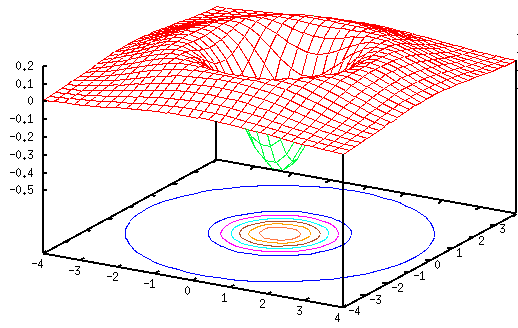
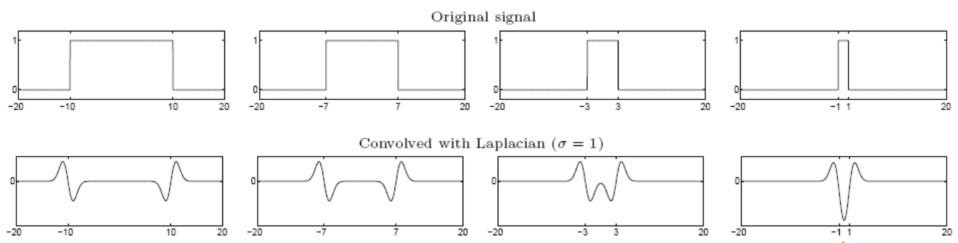
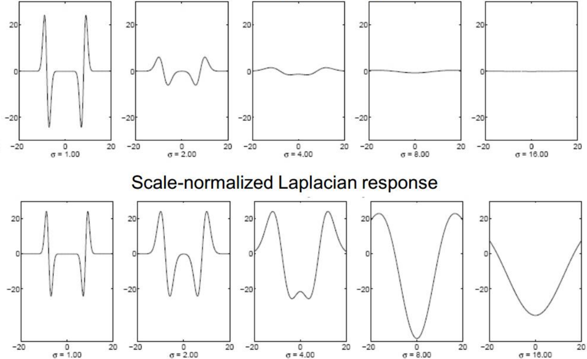
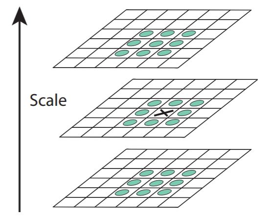
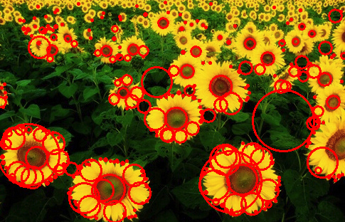
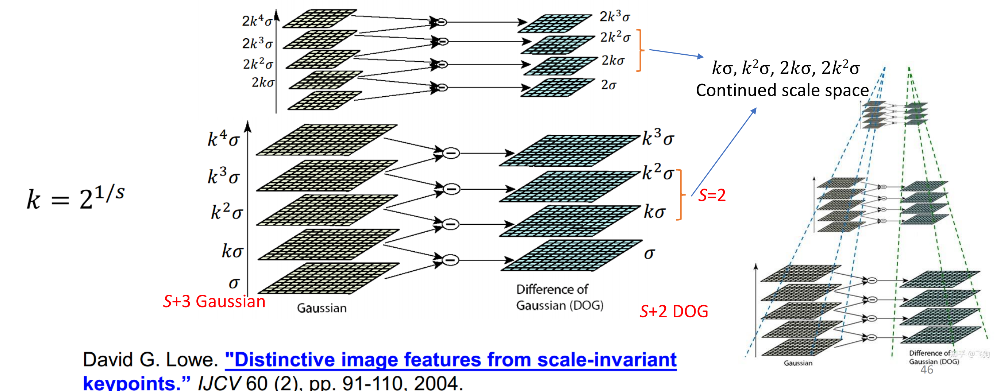

# 斑点检测

斑点的直观感受：与周围颜色差异较大的区域（跨空间、跨尺度）

## 拉普拉斯核（LoG）

拉普拉斯核是拉普拉斯算子作用在高斯核上得到的结果
$$
L = \nabla^{2} g = \frac{\partial^{2} g}{\partial x^{2}} + \frac{\partial^{2} g}{\partial y^{2}}
$$

一维拉普拉斯核与门函数 $G_{\tau}$ 卷积的结果
$$
\begin{align*}
    G_{\tau}(x) * g''(x) &= \frac{1}{2} \bigg[ \varepsilon(x + \tau) + \varepsilon(\tau - x) \bigg] * g''(x) \\[5mm]
    &= \frac{1}{2} \bigg[ g'(x + \tau) + g'(\tau - x) \bigg]
\end{align*}
$$

 

其中
$$
\begin{gather*}
    g'(x) = -\frac{x}{\sigma^{3} \sqrt{2 \pi}} \exp\left( -\frac{x^{2}}{2 \sigma^{2}} \right) \\[5mm]
    g''(x) = \frac{x^{2}}{\sigma^{5} \sqrt{2 \pi}} \exp\left( -\frac{x^{2}}{2 \sigma^{2}} \right) - \frac{1}{\sigma^{3} \sqrt{2 \pi}} \exp\left( -\frac{x^{2}}{2 \sigma^{2}} \right)
\end{gather*}
$$
由于 $\max g'(\cdot) \propto \sigma^{-2}$，可以在卷积结果上额外加入一个 $\sigma^{2}$ 的放缩系数，保证信号不会随 $\sigma$ 衰减。

 

在拉普拉斯核的 $\sigma$ 固定时，响应函数在 $x = 0$ 处的值为 $g'(\tau)$，即 $\tau = \sigma$ 时响应值达到极值。以上的结论也可以推广到二维的圆形斑点，可以利用这一特性来检测图像中的斑点区域。

## SIFT 检测算法

基于 LoG 的检测算法的流程：（1）计算多个 $\sigma$ 值的 LoG 响应（2）通过比较相邻的响应图得到极值响应点，得到当前尺度 $\sigma$ 下的斑点位置（3）通过非极大抑制（NMS）过滤当前尺度下多余的检测结果。

 

由于拉普拉斯核不像高斯核可以进行分离卷积，因此在求多尺度的响应图时 LoG 的计算开销较大，DoG 检测算法提供了一种替代方案，利用高斯核的差分来近似拉普拉斯核。
$$
\begin{gather*}
    \nabla g(\boldsymbol{x}) = -\frac{\boldsymbol{x}}{(2\pi)^{\frac{d}{2}} \sigma^{d + 2}} \exp\left( -\frac{1}{2\sigma^{2}} ||\boldsymbol{x}||^{2} \right) = -\frac{\boldsymbol{x}}{\sigma^{2}} g(\boldsymbol{x}) \\[5mm]
    \nabla^{2} g(\boldsymbol{x}) = -\frac{1}{\sigma^{2}} \bigg(\nabla g(\boldsymbol{x}) \cdot \boldsymbol{x} + g(\boldsymbol{x}) \nabla \cdot \boldsymbol{x}\bigg) = g(\boldsymbol{x}) \sigma^{-4} \bigg(||x||^{2} - d \sigma^{2}\bigg)
\end{gather*}
$$
其中高斯核的协方差矩阵 $\Sigma = \mathrm{diag}(\sigma^{2},\ \sigma^{2},\ \cdots,\ \sigma^{2}) \in \mathbb{R}^{d \times d}$，同时考虑以下关系
$$
\begin{gather*}
    \frac{\partial g}{\partial \sigma} = g(\boldsymbol{x}) \sigma^{-3} \bigg(||x||^{2} - d \sigma^{2}\bigg) \\[5mm]
    \nabla^{2} g(\boldsymbol{x}) = \frac{1}{\sigma} \frac{\partial g}{\partial \sigma} \approx \frac{1}{(k - 1) \sigma^{2}} \bigg[ g(k \sigma) - g(\sigma) \bigg] 
\end{gather*}
$$
因此可以使用 DoG（高斯核差分）将拉普拉斯核的卷积转化为两次高斯平滑和作差，降低时间复杂度。在 SIFT 算法中使用 $s + 3$ 个尺寸的高斯核进行平滑，在相邻尺寸之间进行作差得到 $s + 2$ 个 LoG 响应图

 

相对地，同时可以通过降采样的方式提高卷积核的感受野，相当于增加了卷积核的尺寸。在获得 LoG 响应图之后即可套用基于 LoG 的检测算法的流程，得到图像中不同尺度下的斑点。