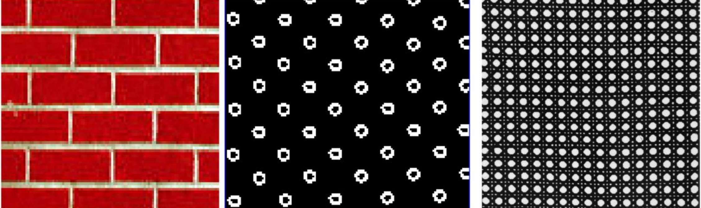
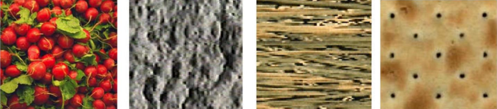
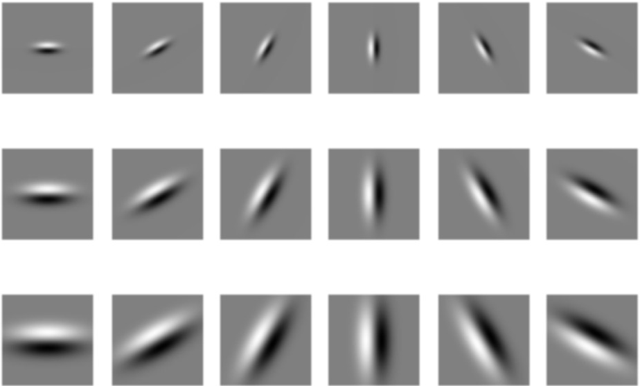
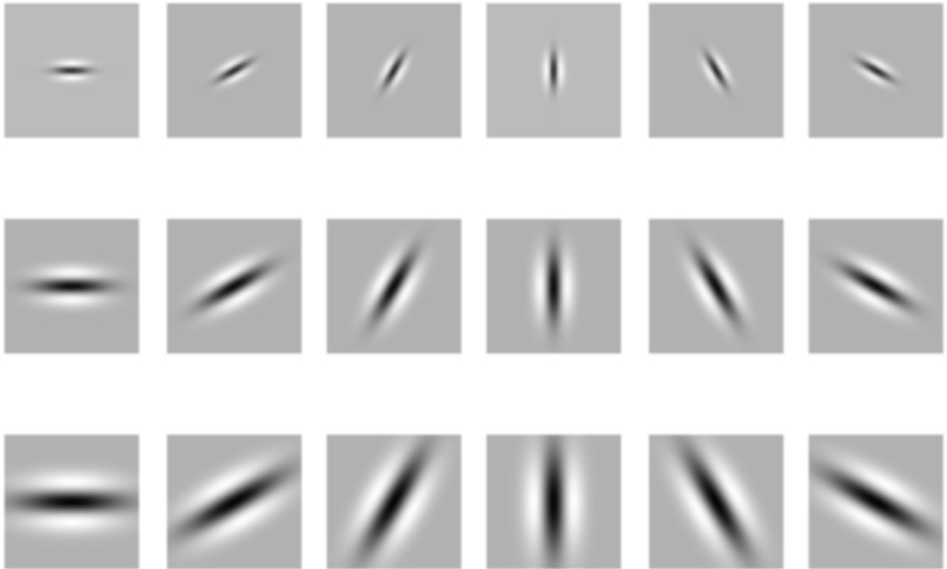
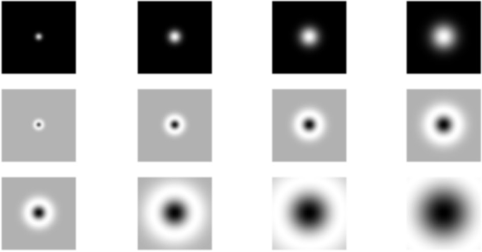

# 纹理

计算机图形学中的纹理既包括通常意义上物体表面的纹理即使物体表面呈现凹凸不平的沟纹，同时也包括在物体的光滑表面上的彩色图案。纹理是由于物体表面的物理属性的多样性而造成的，物理属性不同表示某个特定表面特征的灰度或者颜色信息不同，不同的物理表面会产生不同的纹理图像。纹理是图像中特征值强度的某种局部重复模式的宏观表现，纹理的三个主要标志：

1）某种局部的序列性在比该序列更大的区域内不断重复

2）序列是由基本元素非随机排列组成的

3）各部分大致是均匀的统体,在纹理区域内的任何地方都有大致相同的结构

## 纹理表示（filter bank）

可以通过一系列的卷积核来提取图像中一些特征基元（例如：边缘、条带或斑点）。

- 边缘（不同尺度）

 

- 条带（不同尺度）

 

- 斑点（不同尺度）

 

通过以上特征的统计信息便可以反应纹理的信息，得到 $\mathrm{C} \times \mathrm{H} \times \mathrm{W}$ 的纹理特征图。CNN 可以看做上例中纹理表示卷积核组的扩展和堆叠，实际训练的到的卷积核可能更加复杂。

