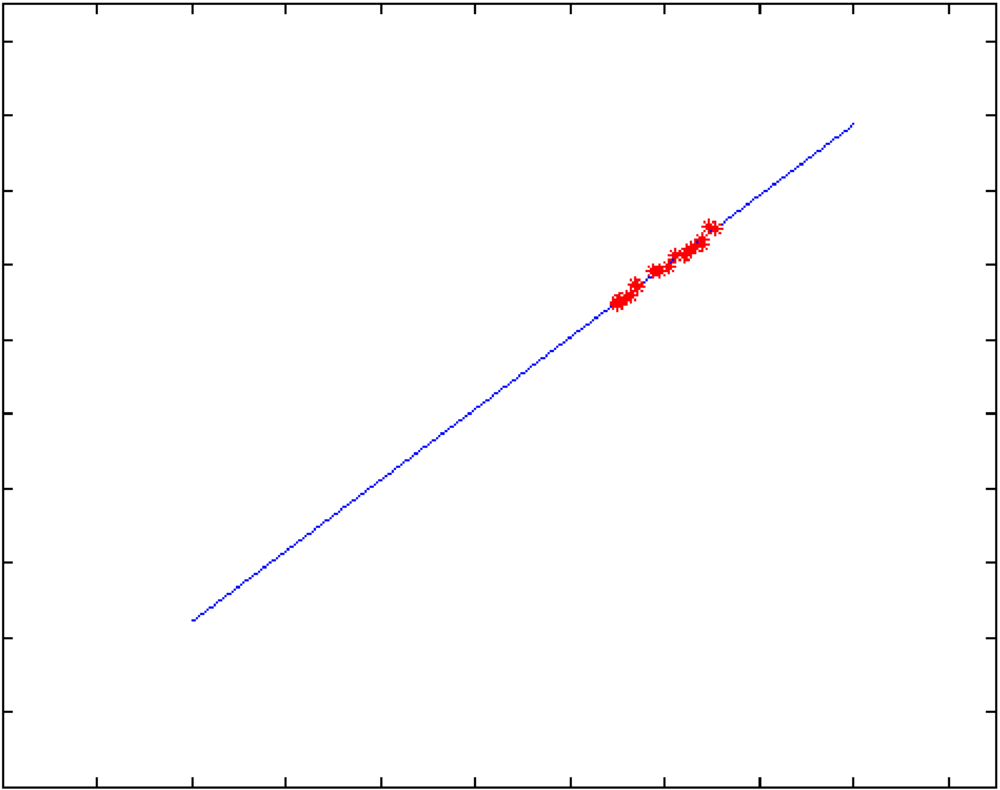
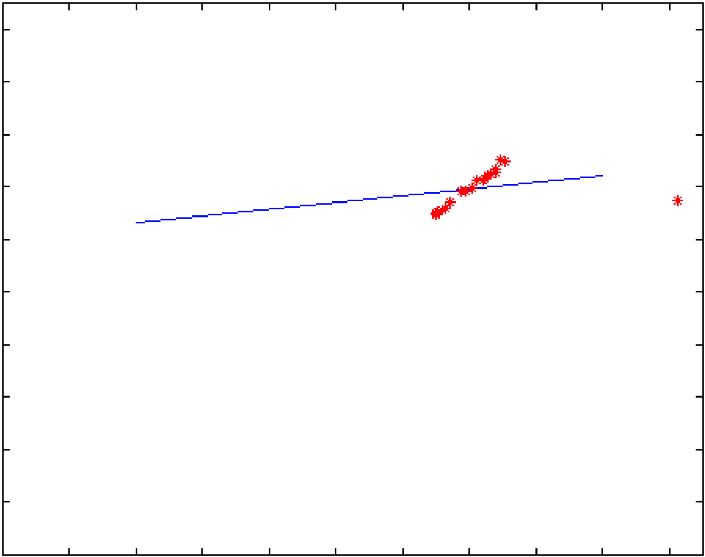
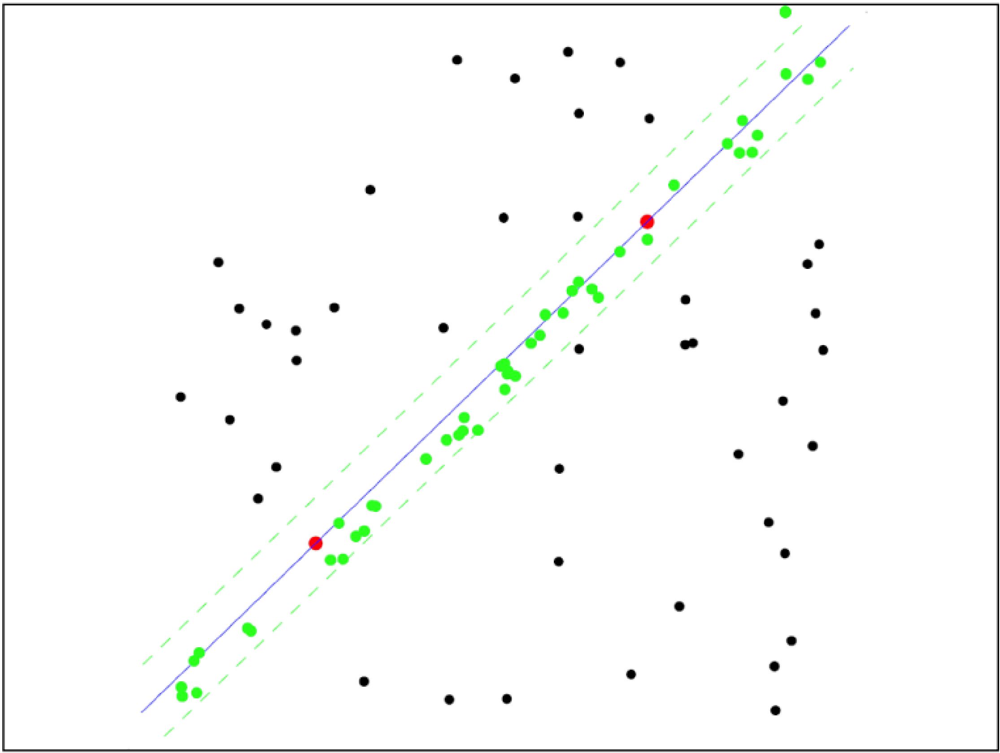
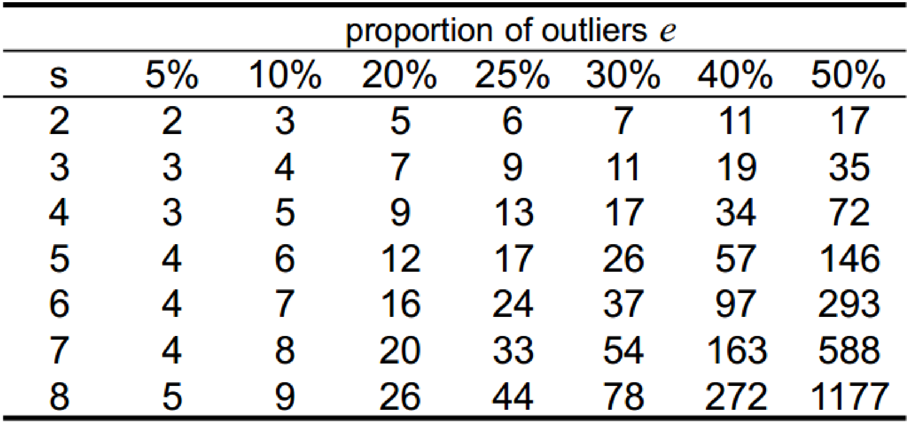
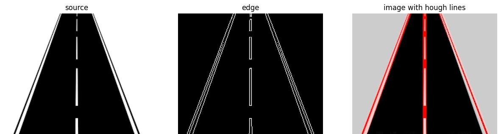
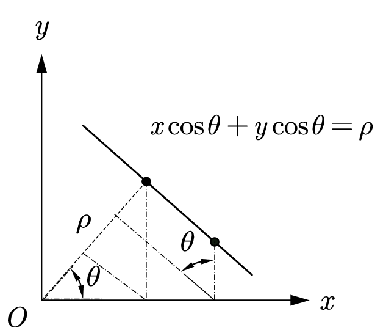
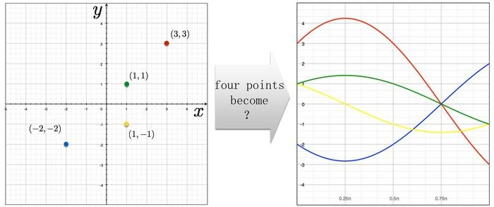

# 拟合

在数据质量良好时可以使用 MSE 来拟合直线，而在数据质量较差时则会被外点影响，拟合结果不理想。

 &emsp;

## RANSAC 算法

RANSAC 算法中需要人为设定或估计的超参数：

|总迭代次数|内点距离阈值|初始化随机点个数|能够代表模型的最少的点数|外点比例（估算）|
|:-:|:-:|:-:|:-:|:-:|
|N|$t$|$s$|$d$|$e$|

通过随机采样、内点筛选以及多次迭代使得 RANSAC 算法能够很好的避免由于离群点对模型造成的影响。

 

由于随机初始化带来的随机性，RANSAC 算法也同样存在着在有限的迭代次数中拟合失败的情况，为了选择合适的迭代次数 N，可以通过估算的真实模型下的外点比例来近似计算 N 次迭代下至少可以得出一次 “好模型” 的概率 $p$（“好模型” 意味着初始采样点只包含内点）：
$$
\bigg[ 1 - (1 - e)^{s} \bigg]^{\mathrm{N}} = 1 - p \quad \Rightarrow \quad \mathrm{N} \ge \log(1 - p) \bigg/ \log \bigg[ 1 - (1 - e)^{s} \bigg]
$$
在指定概率 $p$ 的情况下（例如 $p = 0.99$）可以估算出合适的迭代次数 N

 

## Hough 变换

在边缘检测任务中为了提高边缘的检测质量，可以通过 Hough 变换在边缘检测图上提取图片中的直线集合（广义 Hough 变换可以检测椭圆等形状的线条）。

 

通过斜率和截距表示的直线的形式为：$y = kx + b$，但这种形式的直线方程无法表示 $x = a$ 形式的直线，并且直线参数 $(k,\ b)$ 组成的参数空间为 $(-\infty,\ \infty) \times (-\infty,\ \infty)$。而 Hough 变换中使用方程 $x \cos \theta + y \sin \theta = \rho$ 来描述直线，不仅可以表示 $x = a$ 形式的直线，并且由 $(\rho,\ \theta)$ 组成的参数空间为 $(-\infty,\ \infty) \times [0,\ \pi)$。

在 $(x,\ y)$ 空间中的每个数据点都对应着无数条经过该点的直线，这些直线的 $(\rho,\ \theta)$ 参数点可以构成在 $(\rho,\ \theta)$ 空间中的正弦曲线 $\rho = x_{i} \cos \theta + y_{i} \sin \theta$，这些正弦曲线相交的点意味着一条经过多个数据点的直线参数。

 

利用原始空间和参数空间的对偶性，得到基于 Hough 变换的直线检测检测算法：

 

Hough 变换的思想同样也可以应用于检测二维空间中的圆，利用方程 $(x - u)^{2} + (y - v)^{2} = r^{2}$ 建立原 $(x,\ y)$ 空间到参数 $(u,\ v,\ r)$ 空间的映射，使用相似的投票方法即可得到一系列的圆的集合。

