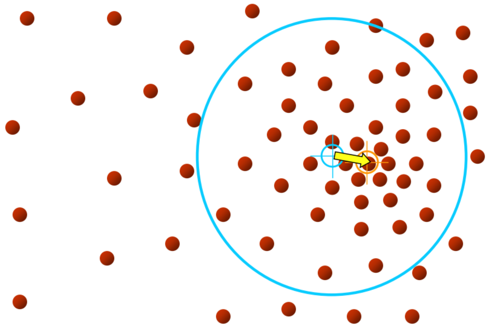

# 图像分割

图像分割的目标是将图像划分为同质区域，其中每个区域共享相似的视觉特征，例如颜色、纹理或强度，同时与相邻区域不同。图像分割提供了对图像中内容的更详细和结构化的理解。通过用特定的类或类别标记每个区域，计算机视觉系统可以更好地掌握场景的语义和上下文。

## 基于 K-Means 的分割方法

 

将图像中每个像素看做一个向量 $(r,\ g,\ b)$，通过 K-Means 聚类算法可以将颜色相似的区域聚为一类。

 

但缺点是实体内部可能出现不连续的情况，并且不同类别但颜色相似的实体也会被聚为相同的聚类簇。因此可以在向量 $(r,\ g,\ b)$ 的基础上加入像素值的空间信息，即针对 $(r,\ g,\ b,\ x,\ y)$ 进行 K-Means 聚类。

 

加入空间位置信息后的聚类结果拥有更好的空间连续性，但随之引入的额外的问题是相同类别但空间距离较远的实体会被聚为不同的聚类簇。

 

同时，基于 K-Means 聚类的分割算法实现简单，但 K-Means 算法本身拥有一些缺点，例如（1）算法空间复杂度高（2）需要人为指定聚类簇的数量 $k$（3）受初始化以及数据噪声敏感等。

## 基于 Mean-Shift 的分割方法

Mean-Shift 算法的基本思想：迭代地将所有的数据点汇集到核密度估计的数据分布上最近的最大值处，从而达到聚类的效果，利用核密度函数估计的数据分布为：
$$
p(\boldsymbol{x}) = \frac{1}{nh^{d}} \sum_{i = 1}^{n} \varphi \left( \left|\left| \frac{\boldsymbol{x} - \boldsymbol{x}_{i}}{h} \right|\right|^{2} \right)
$$
其中 $h$ 为核密度估计的带宽，$\varphi(\cdot)$ 为核函数且 $\varphi(\cdot) \ge 0$，并且假设 $x \ge 0$ 时 $\varphi'(x) \le 0$。

数据分布 $p(\boldsymbol{x})$ 的极大值处满足：
$$
\begin{align*}
    \nabla p(\boldsymbol{x}) &= \frac{1}{nh^{d}} \sum_{i = 1}^{n} \varphi' \left( \left|\left| \frac{\boldsymbol{x} - \boldsymbol{x}_{i}}{h} \right|\right|^{2} \right) \cdot \frac{2}{h^{2}} (\boldsymbol{x} - \boldsymbol{x}_{i}) \\[5mm]
    &= \frac{1}{n h^{d + 2}} \sum_{i = 1}^{n} \phi \left( \left|\left| \frac{\boldsymbol{x} - \boldsymbol{x}_{i}}{h} \right|\right|^{2} \right) (\boldsymbol{x}_{i} - \boldsymbol{x}) = 0
\end{align*}
$$
其中 $\phi(\cdot) = -\varphi'(\cdot)$ 同样为核函数，进而解得数据分布极大值 $\boldsymbol{x}^{*}$：
$$
\boldsymbol{x}^{*} = \boldsymbol{x} + m(\boldsymbol{x}) = \boldsymbol{x} + \sum_{i = 1}^{n} \phi \left( \left|\left| \frac{\boldsymbol{x} - \boldsymbol{x}_{i}}{h} \right|\right|^{2} \right) (\boldsymbol{x}_{i} - \boldsymbol{x}) \bigg/ \sum_{i = 1}^{n} \phi \left( \left|\left| \frac{\boldsymbol{x} - \boldsymbol{x}_{i}}{h} \right|\right|^{2} \right)
$$
Mean-Shift 算法设置
$$
\phi(u) = \left\{
    \begin{matrix}
        1, & 0 \le u < 1 \\[5mm]
        0, & u \ge 1
    \end{matrix}
\right.
$$
对应的单点的更新逻辑为：
$$
\boldsymbol{x}_{i}^{(t + 1)} = \boldsymbol{x}_{i}^{(t)} + \frac{1}{k} \sum_{\boldsymbol{x}_{j} \in \mathcal{S}_{h}} (\boldsymbol{x}_{j} - \boldsymbol{x}_{i}^{(t)}) \qquad k = \bigg| \{ \boldsymbol{x}_{j} \mid \boldsymbol{x}_{j} \in \mathcal{S}_{h} \} \bigg|
$$
其中 $\mathcal{S}_{h}$ 是以 $\boldsymbol{x}_{i}^{(t)}$ 为球心，$h$ 为半径的 $d$ 维超球体，即每次移动到 $\mathcal{S}_{h}$ 内部的数据点的质心处。

 

重复迭代直到收敛即找到了数据点 $\boldsymbol{x}_{i}$ 对应的聚类簇中心，当每个点均找到聚类簇中心时算法结束。

 &emsp;

由于 Mean-Shift 算法的计算复杂度较高，可以利用已有数据点的迭代过程来标记其他数据点的聚类簇，目前的一些加速策略（1）收敛点邻域标记（2）移动路径邻域标记。

